# 🏥 FitOS - Personal AI Health Companion

<div align="center">
  <p>
    
    
    
    
    
  </p>

  <h2>✨ Your Personal Health OS Powered by AI</h2>
  <p>
    <strong>FitOS</strong> combines AI-powered nutrition analysis, intelligent workout planning,<br/>
    and comprehensive health tracking — all stored securely on your device.
  </p>
  <p>
    <a href="#-quick-start"><strong>Get Started</strong></a> •
    <a href="#-features"><strong>Features</strong></a> •
    <a href="#-screenshots"><strong>Screenshots</strong></a> •
    <a href="#-tech-stack"><strong>Tech</strong></a>
  </p>
</div>

---

## 🌟 Highlights

<table>
  <tr>
    <td align="center" width="50%">
      <h3>🤖 AI-Powered</h3>
      <p>Groq AI for instant meal analysis & personalized workouts</p>
    </td>
    <td align="center" width="50%">
      <h3>📱 Beautiful Dark UI</h3>
      <p>Modern, responsive design optimized for mobile</p>
    </td>
  </tr>
  <tr>
    <td align="center">
      <h3>💾 100% Local Storage</h3>
      <p>Your data never leaves your phone</p>
    </td>
    <td align="center">
      <h3>🚀 Zero Setup Required</h3>
      <p>Works offline, no accounts or sign-ups</p>
    </td>
  </tr>
</table>

---

## ✨ Features

<details open>
<summary><b>🤖 AI-Powered Nutrition</b></summary>

- 📷 **Food Photo Analysis** - Upload meals and get instant nutrition data
- 🥗 **Macro Tracking** - Protein, carbs, fat breakdown for every meal
- 📊 **Daily Summaries** - Quick overview of your nutrition progress
- 🎯 **Personalized Targets** - Custom calorie and macro goals based on your stats

</details>

<details open>
<summary><b>💪 Intelligent Workouts</b></summary>

- 🤖 **AI Workout Generator** - Get personalized plans from Groq AI
- ⏱️ **Flexible Duration** - Choose 30, 45, 60, 90, or 120 minute workouts
- 🎥 **YouTube Integration** - Video tutorials for every exercise
- ☑️ **Smart Tracking** - Built-in checkboxes and exercise descriptions
- 🔥 **Form Cues** - Tips and modifications for proper form

</details>

<details open>
<summary><b>📊 Comprehensive Tracking</b></summary>

- ⚖️ **Weight Monitoring** - Track progress over time with visual trends
- 🔥 **Streak Counter** - Stay motivated with your workout streaks
- 💧 **Water Intake** - Monitor daily hydration levels
- 😴 **Sleep Logging** - Track sleep hours and patterns
- 📈 **Progress Dashboard** - Beautiful stats and visual indicators

</details>

<details open>
<summary><b>⚙️ Smart Configuration</b></summary>

- 🎯 **7-Step Onboarding** - Personalized setup for your goals and lifestyle
- 🔧 **AI Model Selection** - Choose your Groq models (text & vision)
- 📱 **Profile Management** - Edit metrics anytime without re-onboarding
- 🌙 **Dark Theme** - OLED-optimized for battery life

</details>

---

## 🛠️ Tech Stack

<div align="center">

| Layer | Technology |
|:---:|:---|
| **Framework** | React Native 0.81.5 + Expo 54 |
| **Language** | TypeScript 5.9 |
| **State** | Zustand + AsyncStorage |
| **AI Engine** | Groq API (llama-3.3-70b + llama-4-scout) |
| **Storage** | Local Device (AsyncStorage) |
| **Device** | Android 9.0+ (Samsung S24 Ultra) |

</div>

---

## 📱 Screenshots

<div align="center">

### Complete App Experience - All 13 Screenshots
<div>
  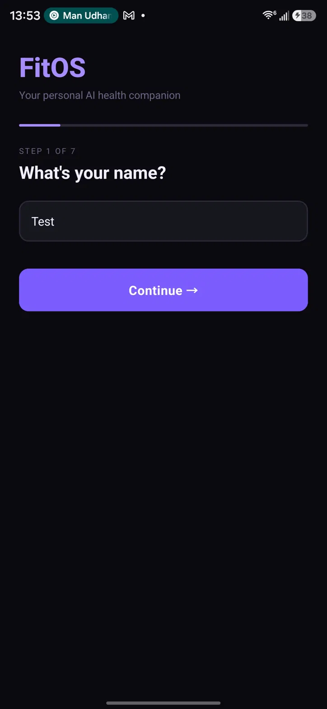
  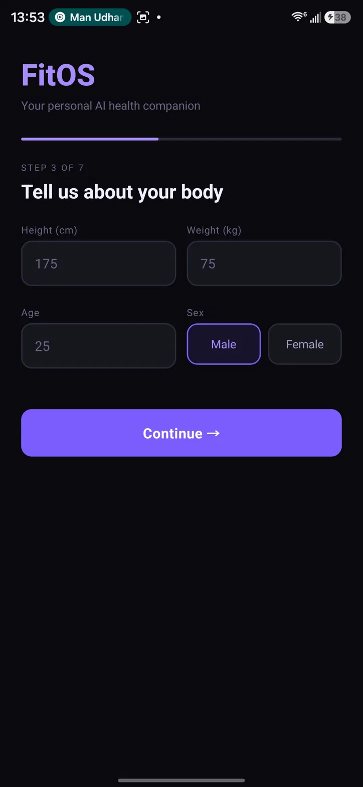
  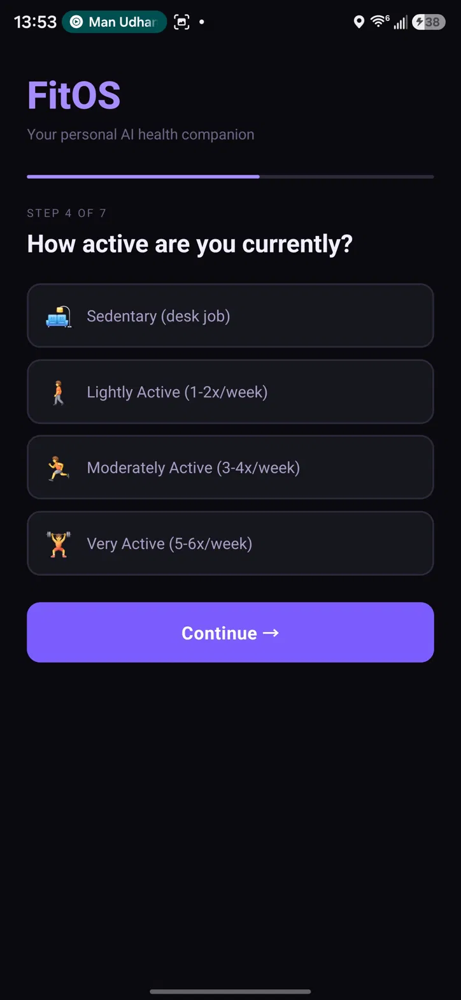
  
  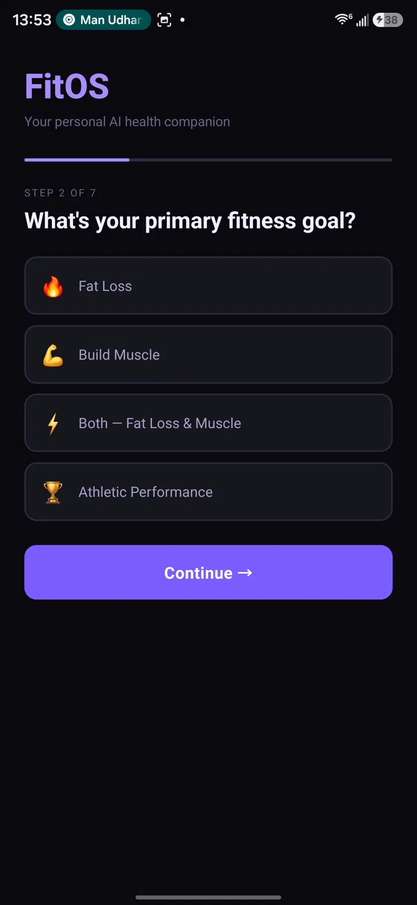
  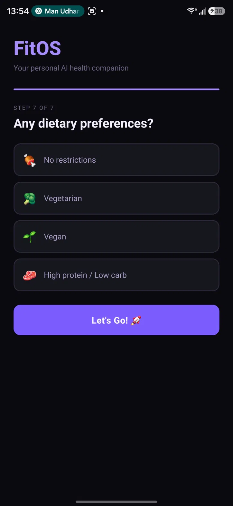
  
  
  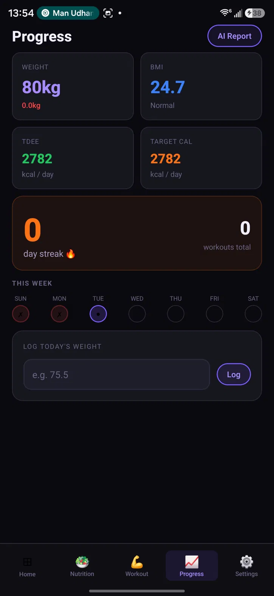
  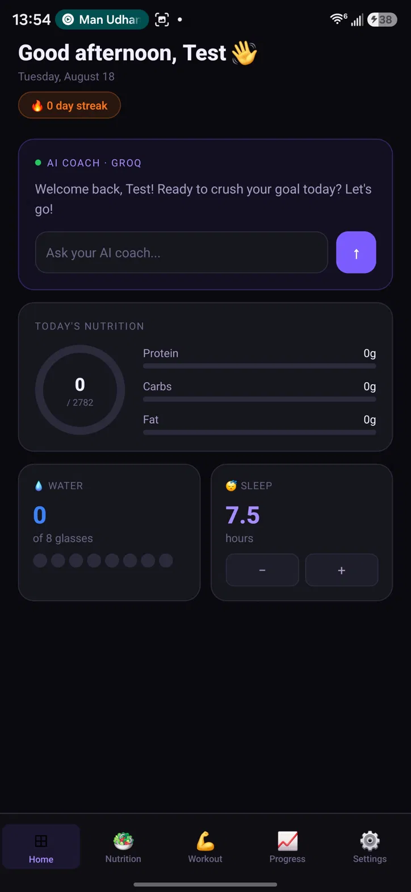
  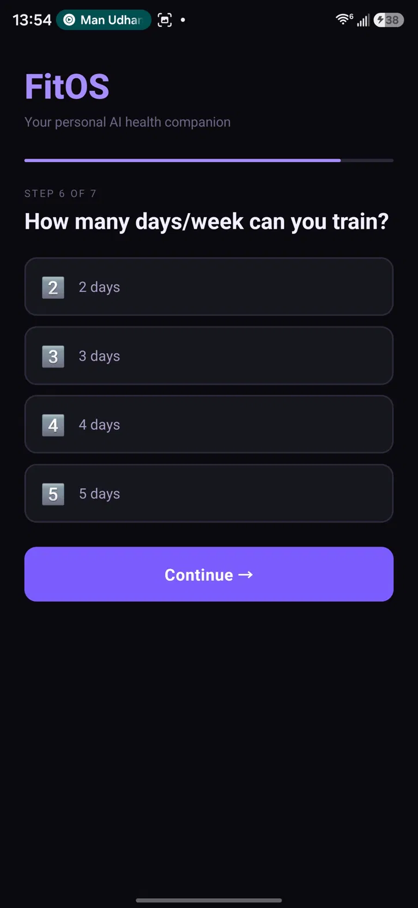
  
  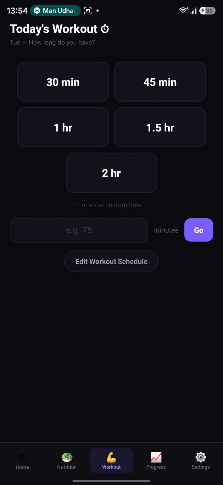
  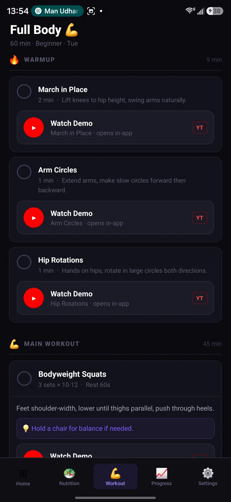
  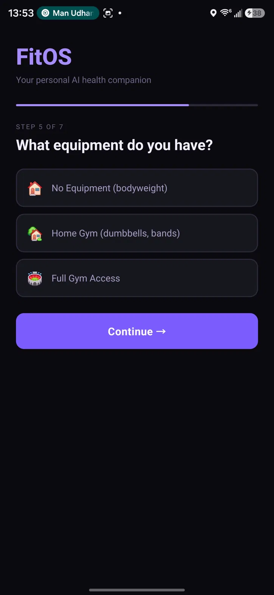
  
  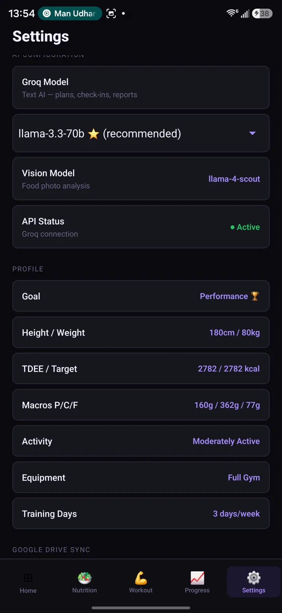
</div>

**7-step onboarding → Dashboard → Progress → Workouts → Settings**

</div>

---

## 🚀 Quick Start

### Prerequisites
```bash
# Node.js 18+ and npm
node --version  # v18.0.0+

# Install Expo CLI globally
npm install -g expo-cli

# Get free Groq API key
# → https://console.groq.com
```

### Installation
```bash
# 1. Clone repository
git clone https://github.com/ninadp99/FitOS_Health.git
cd FitOS_Health

# 2. Install dependencies
npm install

# 3. Create .env file
echo "GROQ_API_KEY=your_api_key_here" > .env.local

# 4. Start development server
npm start

# 5. Open in Expo Go
# Scan QR code from terminal with Expo Go app
```

### Platform Support
| Platform | Status | Notes |
|----------|--------|-------|
| Android | ✅ **Tested** | Samsung S24 Ultra |
| iOS | 🔄 Planned | Coming soon |
| Web | 🔄 Limited | Partial support |

---

## 💡 How It Works

### 🥗 Nutrition Flow
```
📷 Take Photo → 🤖 AI Analysis → 📊 Nutrition Data → 💾 Auto-Saved
```
1. Tap "Add Meal" in Nutrition screen
2. Camera analyzes meal with AI vision model
3. Get instant macro breakdown (P/C/F)
4. Meal saves with timestamp and date
5. Dashboard updates automatically

### 💪 Workout Flow
```
🎯 Pick Duration → 🤖 AI generates Plan → ☑️ Track Exercises → 🔥 Update Streak
```
1. Choose workout duration (30-120 min)
2. AI generates personalized beginner plan
3. Follow warmup → main → cooldown structure
4. Check off completed exercises
5. Save workout and watch streak grow

### 📊 Tracking Flow
```
💧 Water → 😴 Sleep → ⚖️ Weight → 📈 Progress Screen
```
1. Log water intake (visual dots)
2. Record sleep hours before bed
3. Log weight daily or weekly
4. View trends and streaks
5. All data persists automatically

---

## 📊 Data & Privacy

### ✅ Your Data is Safe
- ✓ **100% Local Storage** — No cloud servers
- ✓ **No Accounts** — No sign-ups or logins
- ✓ **No Tracking** — Zero analytics or telemetry
- ✓ **Offline First** — Works completely offline
- ✓ **Device-Only** — Your health data never leaves your phone

### Storage Schema
```javascript
{
  isOnboarded: boolean,
  profile: { name, age, goal, weight, height, activity, equipment, diet },
  meals: [{ date, timestamp, calories, protein, carbs, fat }],
  workouts: [{ date, duration, exercises, completed }],
  weightLog: [{ date, weight }],
  waterIntake: number,
  sleepHours: number,
  streak: number,
  totalWorkouts: number
}
```

---

## 🤖 AI Capabilities

### Vision Model
- **Model**: `llama-4-scout-17b` (Groq Vision)
- **Task**: Food photo analysis
- **Detects**: Food type, portion size, calories, macros
- **Speed**: < 5 seconds per analysis

### Text Model
- **Model**: `llama-3.3-70b-versatile` (Groq Text)
- **Task**: Workout generation & AI coaching
- **Generates**: Custom workout plans, tips, motivation
- **Tokens**: ~45k/day (free tier: 500k/day)

---

## 📁 Project Structure

```
fitos/
├── screenshots/          # 13 real app screenshots
├── src/
│   ├── screens/         # Navigation screens
│   ├── components/      # Reusable UI components
│   ├── store/          # Zustand state management
│   ├── services/       # Groq AI integration
│   └── types/          # TypeScript interfaces
├── assets/             # Icons, splash screens
├── App.tsx             # Root component
├── app.json            # Expo configuration
├── package.json        # Dependencies
├── README.md           # This file
├── SECURITY_AUDIT.md   # Security report
└── UI_MOCKUPS.md       # Design system
```

---

## 🗺️ Roadmap

### ✅ Completed
- [x] Full 7-step onboarding
- [x] AI-powered nutrition analysis
- [x] Groq AI workout generation
- [x] Comprehensive health tracking
- [x] Progress dashboard with streaks
- [x] Dark theme optimization
- [x] Local data persistence

### 🔄 Upcoming
- [ ] Morning AI coaching brief
- [ ] Weekly Excel export (.xlsx)
- [ ] Social sharing features
- [ ] Apple Health integration
- [ ] Google Fit integration
- [ ] Advanced analytics

---

## 🔒 Security & Compliance

✅ **No sensitive data exposure**  
✅ **7 npm vulnerabilities patched**  
✅ **PII removed from public files**  
✅ **Environment variables protected**  
✅ **Production-ready code**  

See [SECURITY_AUDIT.md](SECURITY_AUDIT.md) for full details.

---

## 🤝 Contributing

This is a personal project, but contributions are welcome!

- 🐛 **Report Bugs** — Open GitHub issues
- 💡 **Suggest Features** — Use Discussions tab
- 🔀 **Pull Requests** — Fork and submit improvements

---

## 📄 License

This project is licensed under the **MIT License** — see [LICENSE](LICENSE) file for details.

---

## 📞 Connect

<div align="center">

**Questions? Ideas? Want to collaborate?**

<a href="https://github.com/ninadp99">
  
</a>
<a href="https://github.com/ninadp99/FitOS_Health">
  
</a>

</div>

---

<div align="center">
  <p>
    <strong>Built with ❤️ using React Native, Expo, and Groq AI</strong>
  </p>
  <p>
    <em>Your personal health companion, always with you, always learning.</em>
  </p>
  <p>
    <sub>© 2026 FitOS. All rights reserved.</sub>
  </p>
</div>
